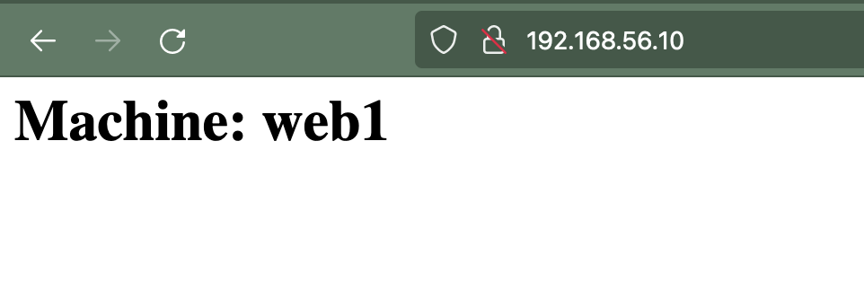
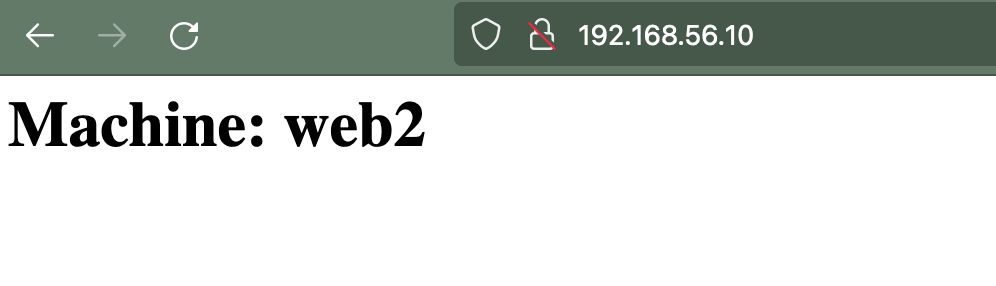

# Multi machine

## Create the machine

```bash
vagrant up
```

## After running

```bash
vagrant status
Current machine states:

lb1                       running (virtualbox)
web1                      running (virtualbox)
web2                      running (virtualbox)

This environment represents multiple VMs. The VMs are all listed
above with their current state. For more information about a specific
VM, run `vagrant status NAME`.

```

## Error

```bash
The IP address configured for the host-only network is not within the
allowed ranges. Please update the address used to be within the allowed
ranges and run the command again.

  Address: 10.0.0.10
  Ranges: 192.168.56.0/21

Valid ranges can be modified in the /etc/vbox/networks.conf file. For
more information including valid format see:

  https://www.virtualbox.org/manual/ch06.html#network_hostonly
```

## Browse

### Web 1



### Web 2

